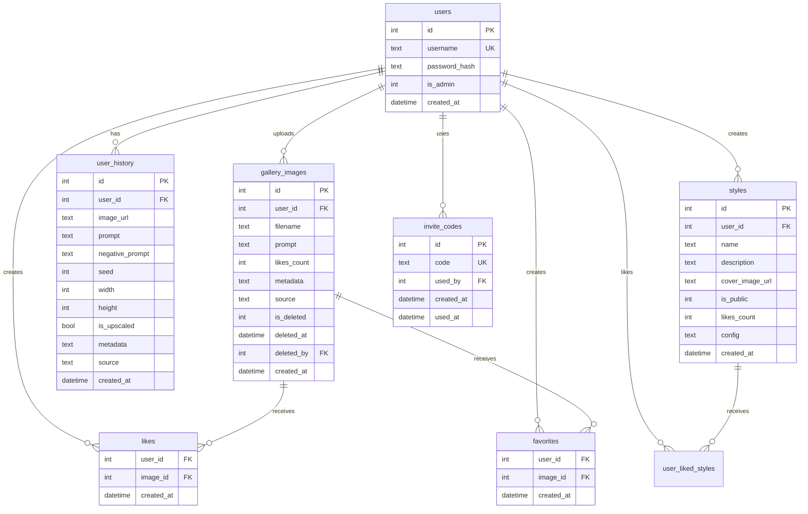
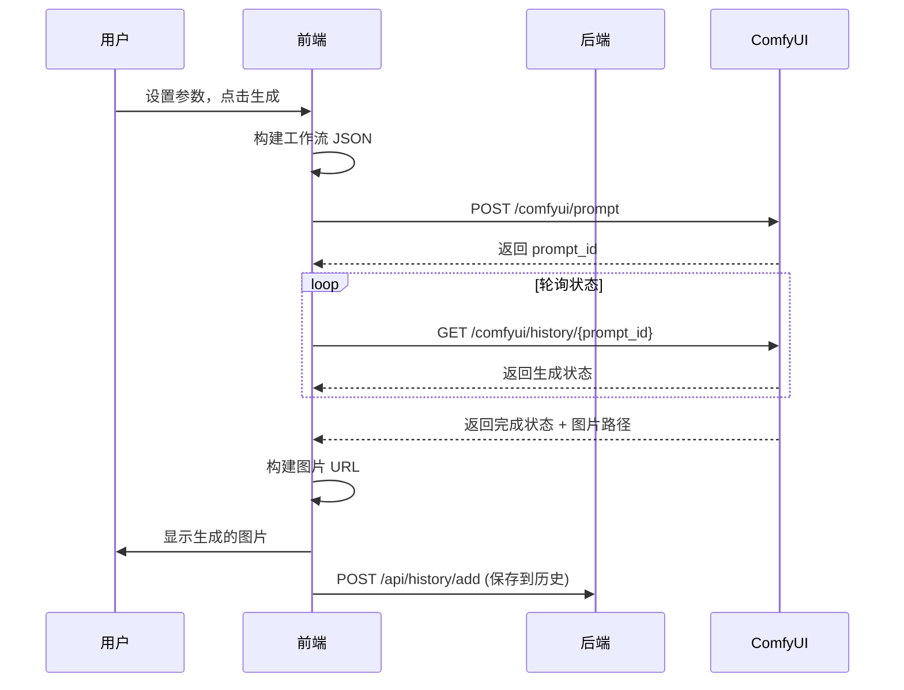

# Newbie 项目完整解析

> 本文档旨在帮助新开发者快速了解 Newbie 项目的架构、技术栈和核心功能，以便快速加入开发团队。

## 目录

1. [项目概述](#1-项目概述)
2. [技术栈](#2-技术栈)
3. [项目结构](#3-项目结构)
4. [前端架构](#4-前端架构)
5. [后端架构](#5-后端架构)
6. [数据库设计](#6-数据库设计)
7. [核心功能模块](#7-核心功能模块)
8. [开发指南](#8-开发指南)
9. [API 参考](#9-api-参考)

---

## 1. 项目概述

**Newbie** 是一个 AI 图像生成 Web 应用，提供多种 AI 图像生成引擎的统一前端界面。用户可以通过直观的界面设置生成参数、管理历史记录、收藏喜欢的图片，并在社区画廊中分享作品。

### 核心特性

- 🎨 **多引擎支持**：支持 ComfyUI (Standard)、NovelAI、NewBie 三种生成引擎
- 👥 **用户系统**：注册/登录、邀请码机制、权限管理
- 🖼️ **图库社区**：上传分享作品、点赞收藏、管理员管理
- 🎭 **风格管理**：保存和分享生成配置（模型、LoRA、提示词组合）
- 📱 **响应式设计**：支持桌面端和移动端

---

## 2. 技术栈

### 前端

| 技术 | 版本 | 用途 |
|------|------|------|
| React | 19.2.1 | UI 框架 |
| React Router | 7.10.1 | 路由管理 |
| TypeScript | 5.8.2 | 类型安全 |
| Vite | 6.2.0 | 构建工具 |
| TailwindCSS | 4.1.17 | CSS 框架 |
| Lucide React | 0.556.0 | 图标库 |

### 后端

| 技术 | 版本 | 用途 |
|------|------|------|
| Node.js | - | 运行时 |
| Express | 4.18.2 | Web 框架 |
| better-sqlite3 | 12.5.0 | SQLite 数据库 |
| bcrypt | 6.0.0 | 密码加密 |
| express-session | 1.18.2 | 会话管理 |
| http-proxy-middleware | 3.0.5 | ComfyUI 代理 |
| sharp | 0.34.5 | 图像处理 |
| multer | 2.0.2 | 文件上传 |

---

## 3. 项目结构

```
newbie/
├── 📄 index.html              # 入口 HTML
├── 📄 index.tsx               # React 入口，路由配置
├── 📄 App.tsx                 # NewBie 模式主组件（暂时隐藏）
├── 📄 StandardApp.tsx         # ComfyUI Standard 模式主组件
├── 📄 NovelAIApp.tsx          # NovelAI 模式主组件
├── 📄 types.ts                # TypeScript 类型定义
├── 📄 constants.ts            # ComfyUI 工作流模板和常量
│
├── 📁 components/             # React 组件
│   ├── AIAssistant.tsx        # AI 助手组件
│   ├── HistoryGallery.tsx     # 历史记录组件
│   ├── LanguageSwitcher.tsx   # 语言切换器
│   ├── MobileDrawer.tsx       # 移动端抽屉组件
│   ├── PromptArea.tsx         # 提示词输入区
│   ├── PromptBuilder.tsx      # 提示词构建器
│   ├── SettingsPanel.tsx      # 设置面板
│   │
│   ├── 📁 Standard/           # Standard 模式专用组件
│   │   ├── LoraSelector.tsx   # LoRA 选择器
│   │   ├── ModelSelector.tsx  # 模型选择器
│   │   ├── StandardPromptArea.tsx
│   │   └── StandardSettingsPanel.tsx
│   │
│   ├── 📁 NovelAI/            # NovelAI 模式专用组件
│   │   ├── CharacterPromptsPanel.tsx
│   │   ├── NovelAIPromptArea.tsx
│   │   ├── NovelAISettingsPanel.tsx
│   │   └── VibeTransferPanel.tsx
│   │
│   └── 📁 Style/              # 风格管理组件
│
├── 📁 pages/                  # 页面组件
│   ├── LoginPage.tsx          # 登录/注册页
│   ├── GalleryPage.tsx        # 公共画廊页
│   └── FavoritesPage.tsx      # 个人收藏页
│
├── 📁 services/               # 前端服务层
│   ├── comfyService.ts        # ComfyUI API (NewBie)
│   ├── standardComfyService.ts # ComfyUI API (Standard)
│   ├── aiService.ts           # AI 聊天服务
│   ├── geminiService.ts       # Gemini API
│   └── constants_standard.ts  # Standard 工作流模板
│
├── 📁 contexts/               # React Context
│   ├── AuthContext.tsx        # 认证状态管理
│   └── LanguageContext.tsx    # 多语言支持
│
├── 📁 locales/                # 国际化文件
│
├── 📁 server/                 # 后端服务
│   ├── index.js               # Express 入口
│   ├── database.js            # 数据库操作
│   │
│   ├── 📁 routes/             # API 路由
│   │   ├── auth.js            # 认证相关
│   │   ├── gallery.js         # 画廊相关
│   │   ├── history.js         # 历史记录
│   │   ├── styles.js          # 风格管理
│   │   ├── novelai.js         # NovelAI 代理
│   │   └── vibe.js            # Vibe Transfer
│   │
│   ├── 📁 services/           # 后端服务层
│   ├── 📁 uploads/            # 上传文件存储
│   └── 📁 data/               # SQLite 数据库文件
│
└── 📁 src/
    └── index.css              # 全局样式
```

---

## 4. 前端架构

### 4.1 路由结构

```mermaid
graph TD
    A[index.tsx] --> B{AuthProvider}
    B --> C{LanguageProvider}
    C --> D[AppRoutes]
    
    D --> E[/login - LoginPage]
    D --> F[/ - StandardApp]
    D --> G[/standard - StandardApp]
    D --> H[/gallery - GalleryPage]
    D --> I[/favorites - FavoritesPage]
    D --> J[/novelai - NovelAIApp]
    
    style E fill:#90EE90
    style F fill:#FFB6C1
    style G fill:#FFB6C1
    style H fill:#FFB6C1
    style I fill:#FFB6C1
    style J fill:#FFB6C1
```

> 🟢 绿色：公开路由 | 🔴 粉色：需要认证

### 4.2 状态管理

项目使用 **React Context** 进行全局状态管理：

| Context | 用途 | 提供的值 |
|---------|------|----------|
| `AuthContext` | 用户认证状态 | `user`, `isAuthenticated`, `login`, `logout`, `register` |
| `LanguageContext` | 多语言支持 | `language`, `setLanguage`, `t` (翻译函数) |

### 4.3 三种生成模式

| 模式 | 主组件 | 特点 |
|------|--------|------|
| **Standard** | `StandardApp.tsx` | 使用本地 ComfyUI，支持自定义模型和 LoRA，三段式提示词 |
| **NovelAI** | `NovelAIApp.tsx` | 调用 NovelAI API，支持 NAI3/NAI4，Vibe Transfer |
| **NewBie** | `App.tsx` | 使用 NewBie 模型（暂时隐藏） |

### 4.4 核心类型定义

```typescript
// 生成的图片
interface GeneratedImage {
  id: string;
  url: string;
  prompt: string;
  negativePrompt?: string;
  timestamp: number;
  width?: number;
  height?: number;
  seed?: number;
  isUpscaled?: boolean;
  source?: 'comfyui' | 'novelai';
  isShared?: boolean;
}

// Standard 模式设置
interface StandardGenerationSettings {
  width: number;
  height: number;
  steps: number;
  cfg: number;
  seed: number;
  sampler_name: string;
  scheduler: string;
  model: string;
  loras: LoraConfig[];
  // 三段式提示词
  prefixPrompt: string;
  positivePrompt: string;
  suffixPrompt: string;
  negativePrompt: string;
  // 放大设置
  enableUpscale: boolean;
  upscaleBy: number;
  upscaleDenoise: number;
  // 二次放大设置
  enableSecondUpscale: boolean;
  secondUpscaleBy: number;
  secondUpscaleDenoise: number;
}

// 风格配置
interface StyleConfig {
  model: string;
  loras: LoraConfig[];
  prefixPrompt: string;
  positivePrompt: string;
  suffixPrompt: string;
  negativePrompt: string;
  type?: 'comfyui' | 'novelai';
}
```

---

## 5. 后端架构

### 5.1 Express 服务器入口

[server/index.js](file:///home/frostleaf/CascadeProjects/newbie/server/index.js) 是后端入口：

```javascript
// 关键配置
const PORT = process.env.PORT || 3001;
const COMFY_URL = process.env.VITE_COMFY_URL || 'http://localhost:8188';
const COMFY_URL_STANDARD = process.env.VITE_COMFY_URL_STANDARD || 'http://localhost:8189';

// ComfyUI 代理
app.use('/comfyui', createProxyMiddleware({ target: COMFY_URL, ws: true }));
app.use('/comfyui-standard', createProxyMiddleware({ target: COMFY_URL_STANDARD, ws: true }));

// API 路由
app.use('/api/auth', authRoutes);
app.use('/api/gallery', galleryRoutes);
app.use('/api/history', historyRoutes);
app.use('/api/styles', stylesRoutes);
app.use('/api/novelai', novelaiRoutes);
app.use('/api/vibe', vibeRoutes);

// 静态文件服务
app.use(express.static(path.join(__dirname, '../dist')));
```

### 5.2 安全机制

| 机制 | 说明 |
|------|------|
| **Session** | 使用 `express-session`，7天有效期，secure cookie |
| **密码加密** | 使用 `bcrypt`，salt rounds = 10 |
| **速率限制** | 10 请求/分钟/IP，用于 AI Chat API |
| **CORS** | 启用凭证传递 |

---

## 6. 数据库设计

使用 **SQLite** (better-sqlite3)，数据库文件位于 `server/data/newbie.db`。

### 6.1 ER 图



### 6.2 表说明

| 表名 | 用途 | 特殊字段 |
|------|------|----------|
| `users` | 用户信息 | `is_admin`: 管理员标志 |
| `invite_codes` | 注册邀请码 | `used_by`: 使用者 ID |
| `gallery_images` | 公共画廊图片 | `is_deleted`, `deleted_at`: 软删除 |
| `likes` | 点赞记录 | 联合主键 (user_id, image_id) |
| `favorites` | 收藏记录 | 联合主键 (user_id, image_id) |
| `user_history` | 用户生成历史 | 7天后自动清理 |
| `styles` | 风格模板 | `config`: JSON 格式配置 |
| `user_liked_styles` | 风格点赞记录 | - |

---

## 7. 核心功能模块

### 7.1 图像生成流程



### 7.2 风格管理系统

风格（Style）是一种保存和复用生成配置的机制：

- **创建风格**：保存当前的模型、LoRA、提示词配置
- **应用风格**：一键加载预设配置
- **分享风格**：设为公开，供其他用户浏览和使用
- **点赞风格**：公开风格可被点赞

### 7.3 画廊管理系统

- **上传图片**：将生成的图片分享到公共画廊
- **点赞/收藏**：互动功能
- **管理员功能**：
  - 软删除图片（移入回收站）
  - 恢复图片
  - 彻底删除

### 7.4 历史记录

- 用户生成的图片自动保存到历史记录
- **7天有效期**：超过7天的记录会被自动清理
- 按生成来源（comfyui/novelai）分类

---

## 8. 开发指南

### 8.1 环境准备

1. **安装依赖**

```bash
# 前端依赖
npm install

# 后端依赖
cd server && npm install
```

2. **配置环境变量**

创建 `.env.local` 文件：

```env
GEMINI_API_KEY=your_gemini_api_key
VITE_COMFY_URL=http://your-comfyui-server:8188
VITE_COMFY_URL_STANDARD=http://your-comfyui-server:8189
```

创建 `.env.server` 文件：

```env
SESSION_SECRET=your_session_secret
SILICONFLOW_API_KEY=your_siliconflow_api_key
NOVELAI_TOKEN=your_novelai_token
```

### 8.2 启动开发服务器

```bash
# 终端 1：启动前端开发服务器
npm run dev

# 终端 2：启动后端服务器
cd server && npm run dev
```

> 前端默认运行在 http://localhost:5173  
> 后端默认运行在 http://localhost:3001

### 8.3 生产构建

```bash
# 构建前端
npm run build

# 启动生产服务器
npm start
```

### 8.4 添加新功能的一般步骤

1. **数据库修改**：在 `server/database.js` 中添加表结构和操作函数
2. **后端路由**：在 `server/routes/` 中添加 API 端点
3. **注册路由**：在 `server/index.js` 中注册新路由
4. **前端类型**：在 `types.ts` 中添加类型定义
5. **前端服务**：在 `services/` 中添加 API 调用函数
6. **UI 组件**：在 `components/` 中添加新组件
7. **页面集成**：在主应用或页面组件中使用新功能

---

## 9. API 参考

### 9.1 认证 API (`/api/auth`)

| 方法 | 路径 | 说明 |
|------|------|------|
| POST | `/login` | 用户登录 |
| POST | `/register` | 用户注册 (需邀请码) |
| POST | `/logout` | 退出登录 |
| GET | `/me` | 获取当前用户信息 |

### 9.2 画廊 API (`/api/gallery`)

| 方法 | 路径 | 说明 |
|------|------|------|
| GET | `/list` | 获取画廊列表 (分页) |
| POST | `/upload` | 上传图片到画廊 |
| POST | `/:id/like` | 点赞/取消点赞 |
| POST | `/:id/favorite` | 收藏/取消收藏 |
| GET | `/admin/check` | 检查管理员权限 |
| DELETE | `/admin/:id` | 软删除图片 |
| GET | `/admin/trash` | 获取回收站列表 |
| POST | `/admin/:id/restore` | 恢复图片 |
| DELETE | `/admin/:id/permanent` | 彻底删除图片 |

### 9.3 历史记录 API (`/api/history`)

| 方法 | 路径 | 说明 |
|------|------|------|
| GET | `/` | 获取用户历史记录 |
| POST | `/add` | 添加历史记录 |
| POST | `/sync` | 批量同步历史记录 |
| DELETE | `/:id` | 删除历史记录 |

### 9.4 风格 API (`/api/styles`)

| 方法 | 路径 | 说明 |
|------|------|------|
| GET | `/my` | 获取我的风格 |
| GET | `/public` | 获取公开风格 |
| POST | `/` | 创建风格 |
| DELETE | `/:id` | 删除风格 |
| POST | `/:id/toggle-public` | 切换公开状态 |
| POST | `/:id/like` | 点赞/取消点赞 |

### 9.5 NovelAI API (`/api/novelai`)

| 方法 | 路径 | 说明 |
|------|------|------|
| POST | `/generate` | 生成图片 |

### 9.6 Vibe API (`/api/vibe`)

| 方法 | 路径 | 说明 |
|------|------|------|
| POST | `/upload` | 上传 Vibe 参考图 |
| GET | `/list` | 获取已上传的 Vibe 图列表 |
| DELETE | `/:id` | 删除 Vibe 参考图 |

---

## 附录：常见问题

### Q: ComfyUI 连接失败？

确保：
1. ComfyUI 服务已启动
2. `.env.local` 中的 URL 配置正确
3. 网络/防火墙允许连接

### Q: 登录时 cookie 不生效？

在生产环境中：
1. 确保使用 HTTPS
2. `sameSite: 'none'` 需要 `secure: true`
3. 检查反向代理设置 (`trust proxy`)

### Q: 历史记录丢失？

历史记录有 **7天有效期**，超时会被自动清理。这是设计行为，旨在节省存储空间。

---

> 📝 文档最后更新：2025-12-24  
> 🔗 相关资源：[AI Studio](https://ai.studio/apps/drive/1QHjIKq_iEXfI5WqwvERp0FcW28W5p39V)
